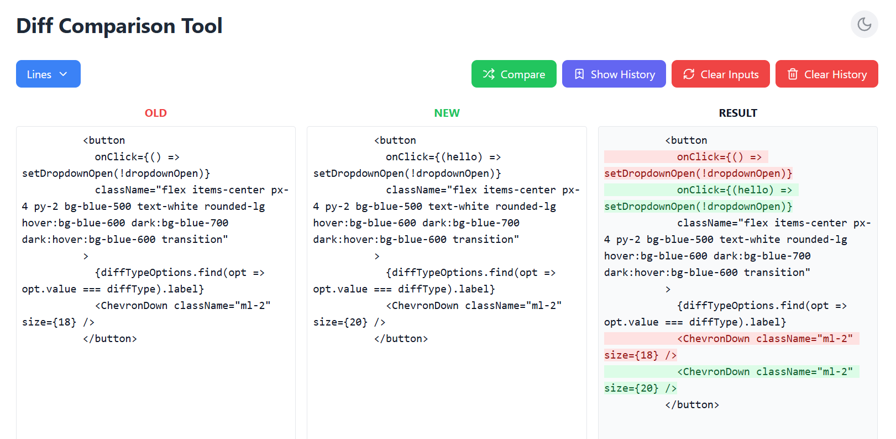

# Diff Comparison Tool

## Overview

A powerful, modern web application for comparing text differences using various diff algorithms. This tool is inspired by the popular `diff` npm package and its online demo.

## Live App
------------

Try out the live app here: [https://valiantsin2021.github.io/Comparer-tool](https://valiantsin2021.github.io/Comparer-tool)

## Features

- Multiple diff comparison modes:
  - Character-level comparison
  - Word-level comparison
  - Line-level comparison
  - Patch-style comparison
- Dark and Light theme support
- Persistent comparison history for last 10 records
- Clean, responsive UI
- Keyboard-friendly interactions

## Inspiration

This project is directly inspired by the [`diff`](https://www.npmjs.com/package/diff) npm package, which provides robust text diffing capabilities. The online demo of the original package showcased the potential for a versatile comparison tool, motivating the creation of this more user-friendly web application.

## Tech Stack

- React
- Vite
- Tailwind CSS
- Lucide React Icons
- diff.js library

## Usage

1. Select comparison type from the dropdown
2. Enter text in "Old" and "New" sections
3. Click "Compare" to see differences
4. Toggle between light and dark themes
5. Access comparison history

## Contributing

Contributions are welcome! Please feel free to submit a Pull Request.

## License

MIT License

## Acknowledgments

- [diff npm package](https://www.npmjs.com/package/diff) for the core diffing logic
- Tailwind CSS for styling
- Lucide for icons
